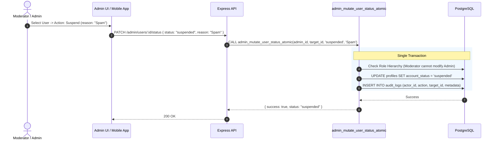

# SkillBridge V3 Admin Operations & Moderation Guide

The SkillBridge Control Plane enables authorized moderators and administrators to govern platform safety, resolve user reports, and manage accounts with transactional audit logging.

---

## 1. Moderation Workflows

### Reports Queue Management
- **View Reports**: Filter by `open`, `investigating`, `resolved`, or `dismissed`.
- **Review Content**: Inspect context (reported messages, room description, or user profile).
- **Take Action**:
  - **Resolve & Dismiss**: Mark report as reviewed with no punitive action.
  - **Resolve & Suspend**: Atomically update user status to `suspended` and record audit log.
  - **Resolve & Ban**: Terminate access permanently.

### User Role Elevation
- Administrators can elevate active users to `moderator` or `tutor`.
- Moderators cannot elevate accounts or alter Administrator privileges.

---

## 2. Audit Trail Guarantees

Every administrative action persists to `public.audit_logs`:
- `actor_id`: UUID of acting moderator/admin.
- `action`: E.g. `moderation.user.status`, `moderation.report.decision`, `moderation.role.update`.
- `target_id`: UUID of target entity.
- `metadata`: JSON payload recording reason, previous state, new state, and client metadata.
