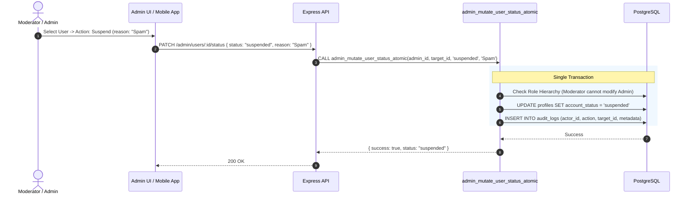

# SkillBridge V3 Admin Operations & Moderation Guide

The SkillBridge Control Plane enables authorized moderators and administrators to govern platform safety, resolve user reports, and manage accounts with transactional audit logging.

---

## 1. Moderation Workflows

### Reports Queue Management
- **View Reports**: Filter by `open`, `investigating`, `resolved`, or `dismissed`.
- **Review Content**: Inspect context (reported messages, room description, or user profile).
- **Take Action**:
  - **Resolve & Dismiss**: Mark report as reviewed with no punitive action.
  - **Resolve & Suspend**: Atomically update user status to `suspended` and record audit log.
  - **Resolve & Ban**: Terminate access permanently.

### User Role Elevation
- Administrators can replace the elevated account role with `moderator`, `admin`, or no elevated role while preserving base product roles.
- Moderators cannot elevate accounts or alter Administrator privileges.

---

## 2. Product Experience Governance

The dedicated Vite control plane exposes `/experience` to administrators for four versioned or targeted product surfaces:

- **Dashboard Builder**: enable widgets, set required/order state, and target roles, campus, or minimum app version.
- **Announcements**: publish localized EN/BN copy with tone, schedule, audience, dismissibility, and a validated internal or HTTPS action.
- **Feature Flags**: enable kill switches and apply deterministic percentage rollouts to selected roles.
- **Experience Content**: publish schema-validated `welcome`, `onboarding`, and `tour` JSON for either locale. Publishing creates a new immutable version and atomically deactivates the old version.

Moderators may read product configuration for operational visibility. Every mutation is enforced as administrator-only by the API and is audit logged; client-side hiding is only a usability layer.

---

## 3. Audit Trail Guarantees

Every administrative action persists to `public.audit_logs`:
- `actor_id`: UUID of acting moderator/admin.
- `action`: E.g. `moderation.user.status`, `moderation.report.decision`, `moderation.role.update`.
- `target_id`: UUID of target entity.
- `metadata`: JSON payload recording reason, previous state, new state, and client metadata.
