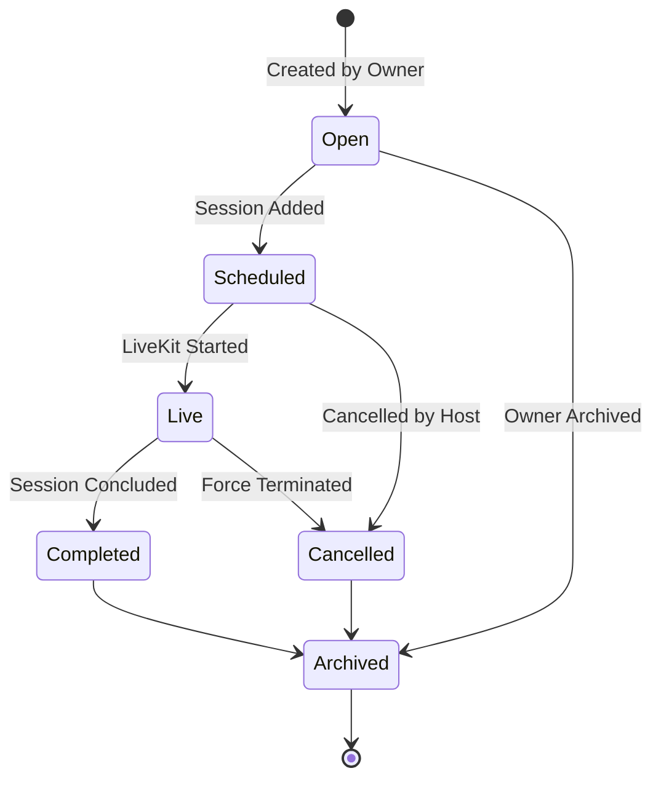
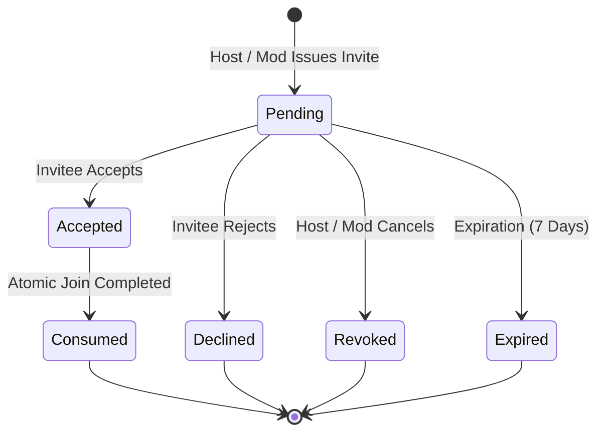
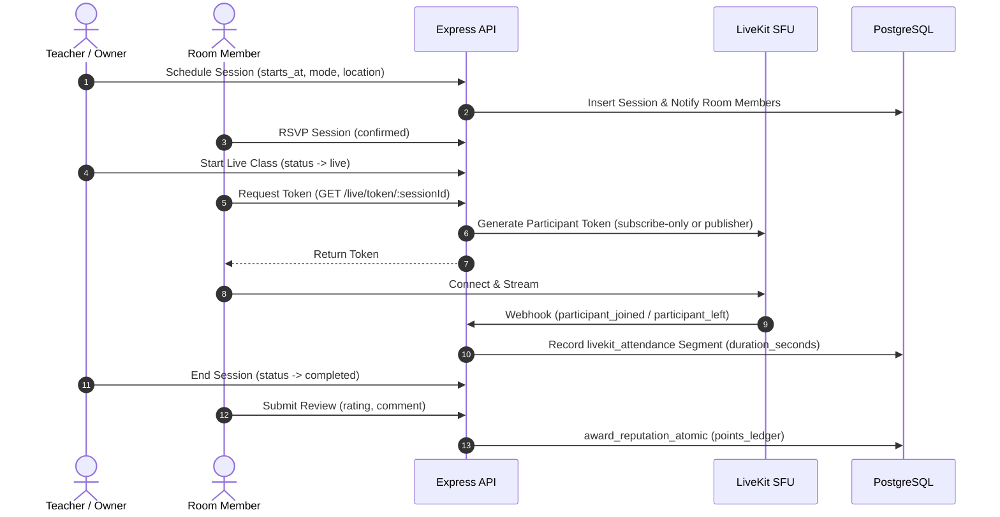

# SkillBridge V3 Domain Logic & Business Rules

SkillBridge V3 enforces server-authoritative business rules across all peer-learning and collaboration workflows.

---

## 1. Study Room Lifecycle & Capacity Rules

### Business Invariants:
1. **Capacity Boundaries**: Rooms strictly enforce a maximum member limit (`2 <= capacity <= 500`). When a room is full, concurrent join attempts are rejected via row-level locking (`SELECT ... FOR UPDATE`).
2. **Delivery Formats**:
   - `online`: Virtual video classroom using LiveKit.
   - `offline`: Physical campus study group requiring a valid `campus_location` (e.g. building and room).
   - `hybrid`: Simultaneous in-person gathering with LiveKit video broadcast.
3. **Owner Integrity**: The room owner cannot leave the room without explicitly transferring ownership to an active member or archiving the room.

---

## 2. Room Invitation State Machine

- **Uniqueness**: Only one active `pending` invitation can exist per `(room_id, invitee_id)` pair.
- **Consumption**: When an invitee joins, the invite status atomically transitions to `consumed` in the same database transaction.

---

## 3. Session Scheduling & Attendance Logic

- **RSVP vs. Attendance**: RSVP status (`invited`, `confirmed`, `declined`) is strictly decoupled from verified attendance (`attended`, `absent`, `duration_seconds`).
- **Review Eligibility**: Reviews are permitted only by verified attendees after the session is marked `completed`.
