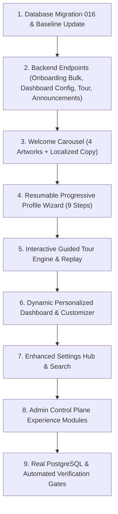

# SkillBridge V3 Experience Expansion — Gap Analysis & Implementation Blueprint

**Date:** 2026-08-20  
**Repository:** `zenbijoy/SKILLBRIDGE-VERSION-01`  
**Starting Commit:** `17157b7` (`17157b71c67d65a18b539956d8e8192d18833084`)  
**Scope:** Dynamic Dashboard, Progressive Onboarding, Guided Tour, Settings & Admin Experience Expansion  

---

## 1. Domain-by-Domain Gap Analysis

| Domain Requirement | Current Code Status | Gaps & Deficiencies | Reusable Code & Strategy | Action Plan |
| :--- | :--- | :--- | :--- | :--- |
| **1. Welcome Carousel & Artwork** | Basic splash/welcome | Missing 4-slide carousel using the 4 generated 2:3 portrait illustrations; missing localized copy over artwork, tablet responsiveness, and skip/analytics. | Asset pipeline in `frontend/assets/onboarding/`, `useTheme`, `useI18n`. | Implement `frontend/app/(auth)/welcome.tsx` with smooth pagination, prefetching, EN/BN localized copy, and navigation to onboarding. |
| **2. Progressive Onboarding Wizard** | Simple 3-step monolithic `onboarding.tsx` | Missing mandatory language gate (`en`/`bn`), debounced username check, atomic bulk skill save, optional step skipping, cross-device step resume, and completion % calculation. | `usePreferencesStore`, `api`, `Field`, `Pill`, `Button`, `Card`. | Create multi-step modular wizard with server-persisted resume, bulk skill API (`POST /profiles/me/onboarding/bulk`), and skip states. |
| **3. Interactive Guided Tour** | Missing | No in-app guided tour with coach marks, skip/resume/replay capabilities, or one-time idempotent gamification rewards. | `points_ledger`, `award_reputation_atomic`, Modal / Portal primitives, `useTheme`. | Implement `frontend/src/features/tour/` with 7 chapters, non-blocking coach marks, AsyncStorage + server sync, and replay from Settings. |
| **4. Dynamic Server-Driven Dashboard** | Static layout querying 8 endpoints | Rigid home screen layout without user reordering, show/hide controls, role presets, or admin-driven module targeting. | `backend/src/routes/dashboard.ts`, `frontend/app/(tabs)/index.tsx`, `FeatureGrid`, `PremiumHero`. | Upgrade dashboard to server-driven widget pipeline with client layout customization, role presets (Learner, Tutor, Researcher, Balanced), and offline fallback. |
| **5. Enhanced Settings Suite** | 11 basic settings files | Fragmented preferences; missing quiet hours config, data-saver enforcement, session management, tutorial replay, and settings search. | `frontend/app/settings/*`, `usePreferencesStore`. | Upgrade settings hub with categorized index, settings search, appearance preview, accessibility switches, notification quiet hours, and tour replay. |
| **6. Admin Product Experience** | Basic reports & user lists | Missing Dashboard Builder, Onboarding Content Manager, Tour Versioning, and Feature Flags. | `admin/src/`, `backend/src/routes/admin.ts`. | Add Product Experience tabs to React/Vite Admin for dashboard widgets, announcements, feature flags, and tour configuration. |
| **7. Database & Migrations** | Migration 015 baseline | Missing tables/columns for versioned onboarding progress, dashboard configs, user dashboard layouts, announcements, and feature flags. | `015_complete_domain_hardening.sql`, `001_skillbridge_baseline.sql`. | Create forward-only migration `016_experience_expansion.sql` and update canonical baseline + real PostgreSQL test suite. |

---

## 2. Technical Architecture & Database Schema Additions

### Migration `016_experience_expansion.sql`
1. **Profile Onboarding Progress Extension**:
   - `onboarding_version` (int default 1)
   - `onboarding_status` (text check in `('not_started', 'in_progress', 'completed', 'skipped')`)
   - `onboarding_step` (text default `'language'`)
   - `profile_completion_percent` (int default 0)
   - `profile_missing_fields` (text[] default ARRAY[]::text[])
   - `guided_tour_version` (int default 1)
   - `guided_tour_status` (text check in `('pending', 'in_progress', 'completed', 'skipped')`)
   - `guided_tour_last_step` (text)
2. **`public.dashboard_configs`**:
   - Server-driven widget templates with audience targeting (`role`, `campus`, `app_version`), schedule bounds, and priority.
3. **`public.user_dashboard_layouts`**:
   - User-customized widget order, visibility, and density preset.
4. **`public.announcements`**:
   - Platform broadcast banners with start/end schedule, target audience, and dismissibility.
5. **`public.feature_flags`**:
   - Staged rollout rules and kill switches.

---

## 3. Implementation Sequence

