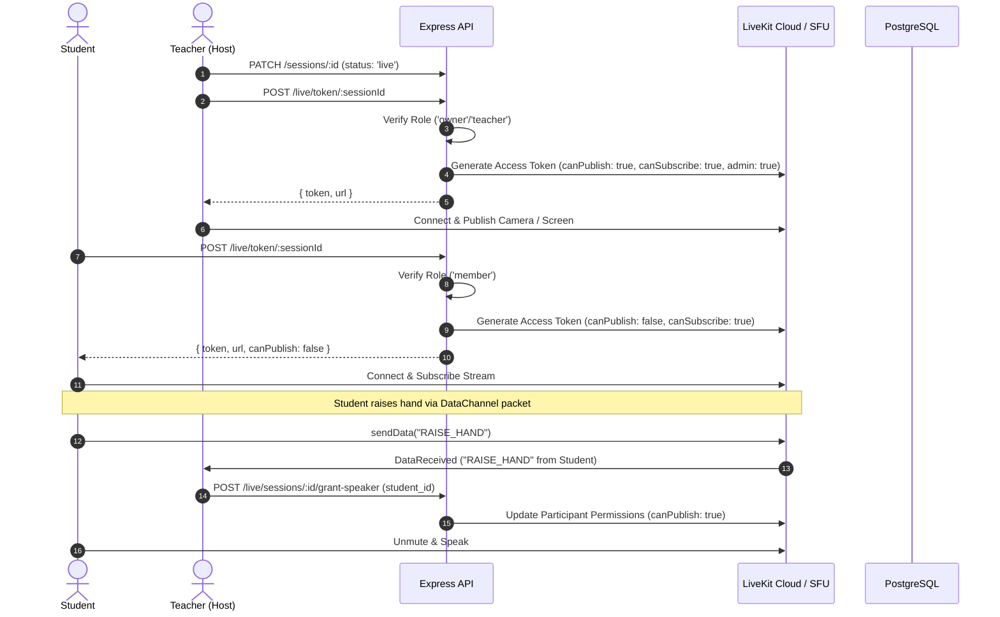

# SkillBridge V3 LiveKit RTC Video Classroom Integration

SkillBridge V3 uses LiveKit SFU (Selective Forwarding Unit) for low-latency interactive video classrooms, audio discussions, and screen sharing.

---

## 1. Classroom Token Generation & Permissions

- Endpoint: `POST /live/token/:sessionId`
- **Security Invariants**:
  - Requires valid JWT and active account status.
  - Verifies user is a confirmed participant or room member.
  - Requires session status to be strictly `'live'`.
  - Room teachers and owners receive publish + data permissions. Ordinary learners connect in subscribe-only mode by default.

---

## 2. Webhook Ingestion & Attendance Tracking

- Endpoint: `POST /webhooks/live`
- LiveKit sends cryptographically signed webhook events (`participant_joined`, `participant_left`, `room_finished`).
- The backend verifies the raw SHA256 signature using `LIVEKIT_API_SECRET`.
- On `participant_joined`, a new row in `livekit_attendance` is inserted with `joined_at = now()`.
- On `participant_left`, the open attendance row is closed with `left_at = now()` and `duration_seconds = EXTRACT(EPOCH FROM (left_at - joined_at))`.
