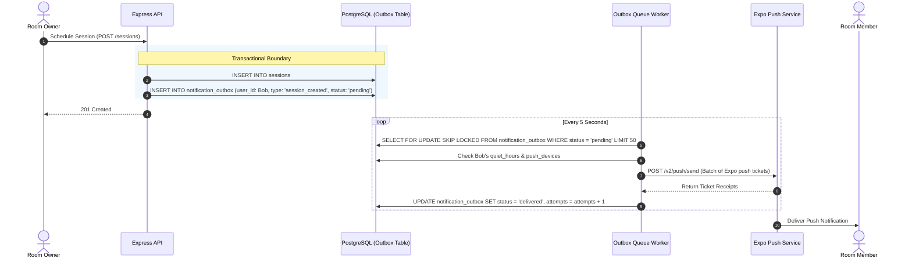

# SkillBridge V3 Durable Notification & Outbox System

SkillBridge guarantees reliable mobile push delivery by combining transactional outbox pattern persistence with an asynchronous worker.

---

## 1. Outbox Worker Architecture

1. **Transactional Insertion**: Business events (room invitations, session alerts, connection requests) insert the business entity and the notification payload in the **same database transaction**.
2. **Safe Concurrent Claims**: The worker claims unhandled items using `SELECT ... FOR UPDATE SKIP LOCKED` to prevent duplicate delivery across multiple API server instances.
3. **Quiet Hours Enforcement**: Before dispatching, the worker checks the user's notification preferences:
   - If current time is within `quiet_hours_start` and `quiet_hours_end`, the notification is deferred or downgraded to in-app only.
4. **Exponential Backoff**: If Expo push returns a transient error (e.g. rate limit, 503), `next_retry_at` is scheduled with exponential jitter (`attempts^2 * 10 seconds`).
