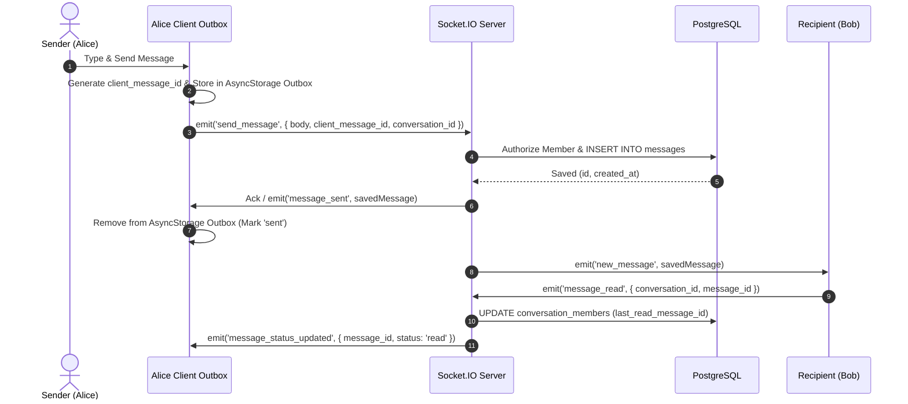
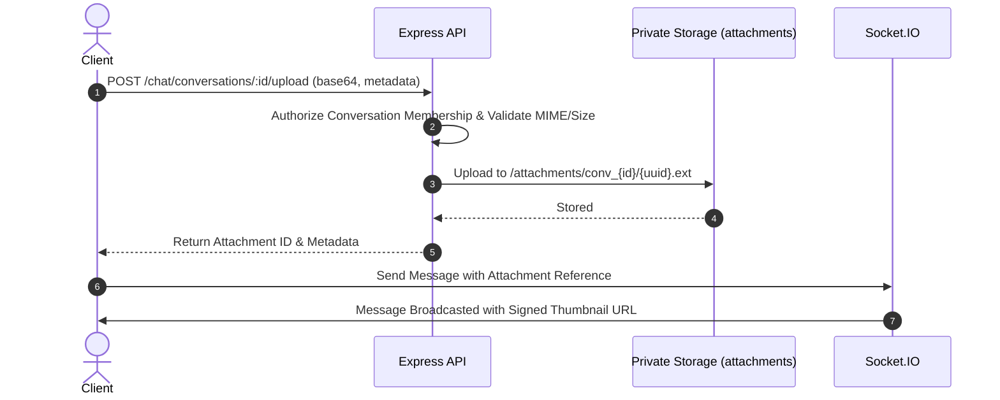

# SkillBridge V3 Realtime Chat & Messaging Architecture

SkillBridge V3 combines Socket.IO for low-latency delivery with PostgreSQL as the immutable, authoritative source of truth.

---

## 1. Offline Outbox & Idempotency

1. **Client Generation**:
   - Every outgoing message is assigned a client-side UUID (`client_message_id`).
   - The message is persisted to `@chat_outbox_{conversationId}` before network transmission.
2. **Optimistic Rendering**:
   - The UI immediately renders the message with a `pending` status icon.
3. **Idempotent Ingestion**:
   - The backend checks `client_message_id` on insert. If already received, the existing message record is returned without creating duplicates.
4. **Offline Drain**:
   - Upon network reconnection or app resumption, the client iterates over the local outbox queue and replays unsent items.

---

## 2. Private Attachments Flow

