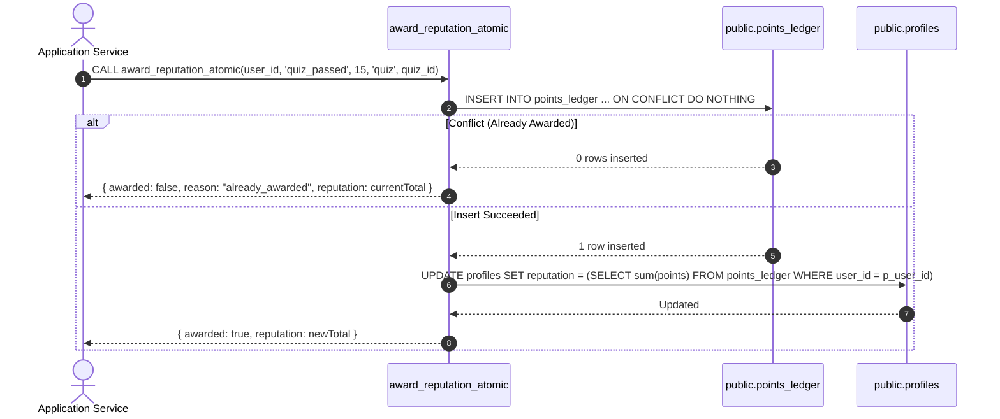

# SkillBridge V3 Reputation & Leaderboard System

Reputation in SkillBridge is governed by an append-only, immutable `points_ledger` table with atomic stored procedure rewards.

---

## 1. Reputation Ledger & Atomic Reward Procedure

### Reputation Reward Matrix
| Event Type | Points | Reference Type | Constraints & Limits |
| :--- | :---: | :---: | :--- |
| `quiz_passed` | +15 | `quiz` | Awarded once per verified skill quiz pass |
| `session_attended` | +3 | `session` | Verified LiveKit or physical check-in (`duration >= 15 min`) |
| `session_taught` | +10 | `session` | Completed session with >= 1 verified attendees |
| `review_submitted`| +1 | `review` | Genuine peer review (self-reviews forbidden) |
| `research_published`| +20 | `research` | Peer-reviewed publication attached to research project |
| `collaboration_completed` | +10 | `research` | Completed milestone collaboration |
| `abuse_penalty` | Negative | `audit` | Administrative penalty for platform violations (audited) |

---

## 2. Category Leaderboards

Leaderboards query all active, non-blocked platform users across 4 categories:
1. **Overall Reputation**: `sum(points_ledger.points)` with time window filter (`weekly`, `monthly`, `all_time`).
2. **Top Tutors**: Aggregate of completed sessions taught, verified learners, and positive teaching ratings.
3. **Top Learners**: Aggregate of attendance hours, verified quiz completions, and completed learning paths.
4. **Top Researchers**: Aggregate of published projects, active collaboration milestones, and contributions.
