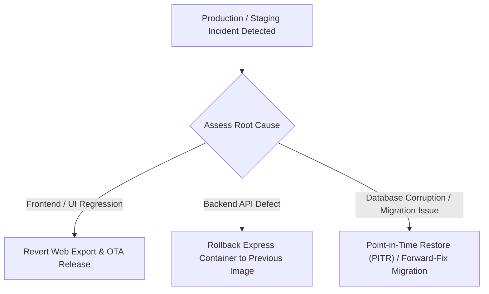

# SkillBridge V3 Rollback and Disaster Recovery Runbook

Guidelines for fast rollback, database restore, and service recovery during operational incidents.

---

## 1. Fast Rollback Strategy

### Application Rollback
- Re-deploy previous Docker container image tag or commit.
- OTA update rollback via EAS Update: `eas update --branch production --message "Rollback to stable"`.

### Database Recovery
- Supabase provides automated daily backups and Point-In-Time Recovery (PITR).
- If an incremental migration needs mitigation, deploy a **forward-only repair migration** (`016_fix_...sql`) rather than mutating past migration history.

---

## 2. Disaster Recovery Protocol

1. **Service Disruption (Database Unreachable)**:
   - Express API returns `503 Service Unavailable` with structured error codes.
   - Socket.IO gateway gracefully queues client events in client-side outboxes.
2. **Media Failure (LiveKit Outage)**:
   - LiveKit classroom displays clear offline banner.
   - Text chat and persistent session notes remain accessible via Socket.IO and PostgreSQL.
3. **Data Loss Mitigation**:
   - `points_ledger` and `audit_logs` are append-only.
   - In case of profile reputation cache drift, run `UPDATE profiles p SET reputation = coalesce((SELECT sum(points) FROM points_ledger WHERE user_id = p.id), 0)`.
