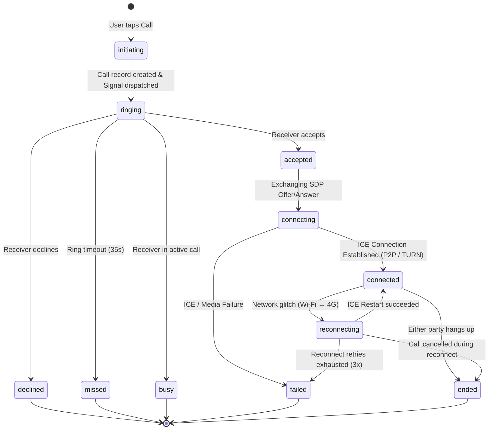

# SkillBridge Realtime Communication Hybrid Architecture Audit (Phase 0)

**Date**: 2026-08-23  
**Auditor**: Principal System Architect  
**Target Architecture**:
- **1-to-1 Audio & Video**: Raw WebRTC P2P (STUN first → Cloudflare TURN fallback)
- **3+ Interactive Users (Group Study/CT Prep/Mentoring)**: LiveKit SFU
- **Large Club Broadcast (100–10,000+ Viewers)**: YouTube Live Embed
- **Post-Broadcast Interactive Q&A Stage**: LiveKit Stage Handoff

---

## 1. Executive Summary & Audit Findings

| Audit Question | Repository Status | Technical Details |
| :--- | :--- | :--- |
| **1. `react-native-webrtc` installed?** | ✅ **YES** (`@livekit/react-native-webrtc` v144.1.2) | Standard WebRTC implementation exposing `RTCPeerConnection`, `mediaDevices`, `RTCView`, `RTCIceCandidate`, etc. Compatible with iOS/Android/macOS. |
| **2. Existing raw WebRTC code?** | ⚠️ **PARTIAL** | WebRTC stream recording exists in `useLocalRecorder.ts`. P2P peer connection negotiation (SDP offer/answer, ICE candidates) is not yet implemented. |
| **3. Existing LiveKit call code?** | ✅ **YES** | `backend/src/routes/live.ts` and `frontend/src/features/live/LiveRoomScreen.web.tsx` implement LiveKit token minting and video conference rooms. |
| **4. How LiveKit tokens are generated?** | ✅ **SECURE BACKEND** | Minted in `backend/src/routes/live.ts` via `livekit-server-sdk` (`AccessToken`) with 4h TTL and room permissions (`canPublish`, `canSubscribe`). Secret keys remain strictly on backend. |
| **5. Realtime signaling mechanism?** | ✅ **SOCKET.IO** | Socket.IO server at `backend/src/socket.ts` attached to Express server. Client singleton in `frontend/src/lib/socket.ts`. Handshake validates Supabase auth JWT. |
| **6. WebSocket / Socket.IO layer?** | ✅ **YES (v4.8.3)** | Integrated with user-specific channels (`user:${userId}`) and conversation rooms (`conversation:${conversationId}`). |
| **7. FCM Push Notification support?** | ✅ **YES** | `backend/src/services/PushService.ts` and `push.ts` dispatch notifications via Expo Push API / FCM to registered `device_tokens`. |
| **8. Call records in Supabase?** | ❌ **NOT YET** | `public.sessions` exists for scheduled classroom sessions, but a dedicated `public.calls` table for 1:1 call state tracking does not exist yet. |
| **9. Incoming-call UI support?** | ⚠️ **PARTIAL** | `frontend/app/call/[id].tsx` handles outgoing calls, but a global floating/modal `IncomingCallModal` for ringing invites is required. |
| **10. Expo Go vs Development Builds?** | ✅ **DEV BUILDS** | Configured with `expo start --dev-client` and `npx expo run:android`. Development builds are mandatory due to native WebRTC modules. |
| **11. Native permissions configured?** | ✅ **YES** | `CAMERA`, `RECORD_AUDIO`, `POST_NOTIFICATIONS` in `frontend/app.json` + iOS `infoPlist` usage descriptions + `@livekit/react-native-expo-plugin`. |
| **12. Existing call state machines?** | ⚠️ **PARTIAL** | State machine documented for Accounts and Rooms in `docs/STATE_MACHINES.md`. Strict Call FSM is needed for 11 states. |
| **13. Conflict with existing features?** | 🛡️ **NO CONFLICT** | Clean provider separation: 1:1 calls route to P2P WebRTC; 3+ users route to LiveKit; Broadcasts route to YouTube Live. |

---

## 2. Current Architecture vs Target Hybrid Architecture

### Current Architecture Flow
```
All Video/Audio Traffic ───> LiveKit SFU (Consumes participant minutes for 1:1 calls)
Large Broadcasts        ───> YouTube Live (Zero server bandwidth)
Signaling & Chat        ───> Socket.IO (Express / Node.js)
Push Alerts             ───> Expo Push Service / FCM
```

### Target Hybrid Architecture Flow
```
                   Routing Decision Matrix
                  ┌──────────────────────┐
                  │ How many peers /     │
                  │ what session type?   │
                  └──────────┬───────────┘
                             │
       ┌─────────────────────┼─────────────────────┐
       ▼                     ▼                     ▼
[ 2 Participants ]    [ 3+ Participants ]    [ Broadcast Mode ]
 (1:1 Audio/Video)    (Class / CT Prep)       (Club Live Event)
       │                     │                     │
       ▼                     ▼                     ▼
  Raw WebRTC P2P        LiveKit SFU           YouTube Live
  (STUN -> TURN)       (Selective Forward)   (Embedded View)
```

---

## 3. Detected Problems & Architectural Gaps

1. **Unnecessary LiveKit Quota Consumption**:
   - 1-to-1 peer mentoring and quick doubt-solving currently use LiveKit participant minutes. 100 calls × 10 mins = 2,000 minutes.
   - *Fix*: Route all 2-participant calls through Raw WebRTC P2P (Direct STUN, Cloudflare TURN relay only as fallback).
2. **Missing `public.calls` Database Table**:
   - No persistent audit record for 1:1 calls (caller, callee, type, status, duration, end_reason).
   - *Fix*: Create migration `020_calls_p2p_hybrid.sql` with strict check constraints, indexes, and RLS policies.
3. **Missing P2P Signaling Events in Socket.IO**:
   - `backend/src/socket.ts` only handles chat conversations and presence.
   - *Fix*: Add authenticated signaling handlers (`call:incoming`, `call:offer`, `call:answer`, `call:ice-candidate`, `call:reject`, `call:end`, `call:busy`, `call:reconnect`).
4. **Cloudflare TURN Dynamic Credential Minting**:
   - Need backend service (`backend/src/services/turn.ts`) and endpoint `GET /api/v1/calls/ice-servers` returning short-lived ephemeral TURN credentials without exposing the root Cloudflare API token.
5. **Global Incoming Call Modal**:
   - The app needs a root-level listener that displays the incoming call screen whenever `call:incoming` socket event or FCM push is received.

---

## 4. Files Involved & Module Map

```
backend/
├── src/
│   ├── config/
│   │   └── env.ts                          # [MODIFY] Add CLOUDFLARE_TURN_* & P2P_CALLS_ENABLED env vars
│   ├── routes/
│   │   ├── calls.ts                        # [NEW] REST API for call creation, lifecycle, ICE servers
│   │   └── live.ts                         # [PRESERVE] Keep LiveKit group token routes intact
│   ├── services/
│   │   ├── turn.ts                         # [NEW] Cloudflare ephemeral TURN credential generator
│   │   ├── push.ts                         # [MODIFY] Add 'call' notification handling
│   │   └── RedisService.ts                 # [PRESERVE] Rate limiting & active presence
│   ├── socket.ts                           # [MODIFY] Add call:* authenticated signaling handlers
│   └── app.ts                              # [MODIFY] Mount /api/v1/calls router

frontend/
├── src/
│   ├── features/
│   │   ├── calls/
│   │   │   ├── hooks/
│   │   │   │   ├── useWebRTCCall.ts        # [NEW] Core WebRTC P2P hook (offer, answer, ICE exchange)
│   │   │   │   ├── useCallSignaling.ts     # [NEW] Socket.IO signaling bridge
│   │   │   │   ├── useCallMedia.ts         # [NEW] getUserMedia & track control
│   │   │   │   └── useCallLifecycle.ts     # [NEW] FSM transition validator
│   │   │   ├── services/
│   │   │   │   ├── peerConnection.ts       # [NEW] RTCPeerConnection factory with STUN/TURN fallback
│   │   │   │   ├── iceServers.ts           # [NEW] Ephemeral ICE server fetcher
│   │   │   │   └── webrtc.ts               # [NEW] Cross-platform WebRTC abstraction (Web + Native)
│   │   │   ├── components/
│   │   │   │   ├── IncomingCallModal.tsx   # [NEW] Global incoming call modal
│   │   │   │   ├── CallControls.tsx        # [NEW] Mute, Camera, Flip, Speaker, End actions
│   │   │   │   └── ConnectionQuality.tsx   # [NEW] RTT, packet loss & quality indicator
│   │   │   └── types.ts                    # [NEW] CallStatus, CallType, SignalPayload definitions
│   │   └── live/                           # [PRESERVE] Existing LiveKit room components intact
│   └── lib/
│       ├── socket.ts                       # [PRESERVE] Shared socket client
│       └── database.ts                     # [MODIFY] Local call history caching
├── app/
│   ├── _layout.tsx                         # [MODIFY] Mount IncomingCallModal globally
│   └── call/[id].tsx                       # [MODIFY] Wire to useWebRTCCall hook

infra/
└── supabase/
    └── migrations/
        └── 020_calls_p2p_hybrid.sql        # [NEW] Database migration for calls & RLS
```

---

## 5. State Machine Lifecycle (`CallStatus`)



---

## 6. Security & Privacy Matrix

| Risk | Mitigation |
| :--- | :--- |
| **Exposing Cloudflare API Token** | Token stays 100% on backend; frontend only receives short-lived ephemeral credentials (`ttl = 3600s`). |
| **Unauthorized Call Creation** | Endpoint checks authentication, ensures caller != callee, and validates no mutual blocks in `user_blocks`. |
| **Spoofed Signaling Events** | Backend verifies `socket.data.userId` matches either `caller_id` or `callee_id` of the referenced `callId`. |
| **Logging Sensitive Media/SDP** | SDP strings, candidate private IPs, and TURN passwords are never logged in production. |
| **Media Traffic Leak to Backend** | Media streams travel strictly peer-to-peer (or via Cloudflare TURN relay). Zero audio/video bytes touch the Node.js backend. |

---

## 7. Rollback & Fail-Safe Strategy

The entire WebRTC P2P calling feature will be governed by a single environment variable and dynamic configuration flag:

```env
P2P_CALLS_ENABLED=false
```

- If `P2P_CALLS_ENABLED=true`: 1:1 calls use direct WebRTC P2P (STUN/TURN).
- If `P2P_CALLS_ENABLED=false`: The system instantly falls back to creating a 2-person LiveKit room without any app redeployment or code rollback.

---

## 8. Definition of Done Checklist

- [ ] `020_calls_p2p_hybrid.sql` migration runs cleanly on PostgreSQL.
- [ ] Backend routes `/api/v1/calls`, `/api/v1/calls/ice-servers`, `/accept`, `/reject`, `/end` covered by unit tests.
- [ ] Socket.IO signaling events verified with authorization tests.
- [ ] Direct WebRTC P2P audio & video functional on Web and Android/iOS development builds.
- [ ] Cloudflare STUN default + TURN fallback operational when direct UDP is blocked.
- [ ] Existing LiveKit group study rooms (3+ participants) and YouTube club broadcasts 100% functional without regressions.
- [ ] Full automated test suite and typechecks pass (`npm test`, `npm run typecheck`).
