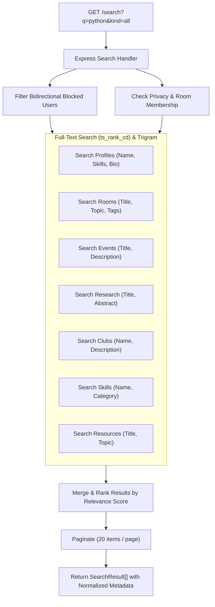

# SkillBridge V3 Search & AI Recommendations Engine

SkillBridge V3 provides unified search and transparent multi-factor peer matching algorithms.

---

## 1. Global Search Architecture

The unified search endpoint (`GET /search`) queries 7 distinct domain entities in a single request:
- `peers` (`public.profiles`)
- `rooms` (`public.rooms`)
- `events` (`public.events`)
- `skills` (`public.skills`)
- `clubs` (`public.clubs`)
- `research` (`public.research_projects`)
- `resources` (`public.resources`)



---

## 2. Multi-Factor AI Peer Recommendation Algorithm

The recommendation engine (`GET /recommendations/ai-matches`) matches learners and tutors based on a deterministic 0–90 compatibility score:

```
Total Score = Skill Overlap (0-40)
            + Complementary Intent (0-25)
            + Campus / University Match (0-10)
            + Study Mode Compatibility (0-10)
            + Contribution Quality (0-5)
```

### Recommendation Scoring Breakdown:
1. **Skill Overlap (0–40 pts)**:
   - Evaluates intersection between user's wanted skills (`skills_wanted`) and peer's teaching skills (`skills_known`).
   - +15 pts per verified skill match (capped at 40).
2. **Complementary Intent (0–25 pts)**:
   - +25 pts if Peer wants to learn what User teaches, and User wants to learn what Peer teaches (Mutual Exchange).
3. **Campus / Department (0–10 pts)**:
   - +10 pts for same university/campus.
4. **Study Mode Compatibility (0–10 pts)**:
   - +10 pts if both prefer `online`, `offline`, or `hybrid`.
5. **Quality Bonus (0–5 pts)**:
   - +5 pts if Peer has verified quiz badges and positive session feedback.
