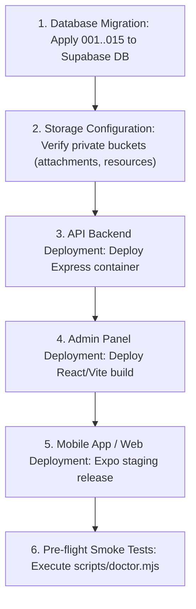

# SkillBridge V3 Staging Deployment Runbook

Step-by-step instructions for provisioning, configuring, and verifying SkillBridge V3 in an isolated staging environment.

---

## 1. Environment Variables Checklist

Ensure the following variables are configured in staging `.env`:

```ini
# Server Configuration
PORT=4000
NODE_ENV=staging
CORS_ORIGIN=https://staging.skillbridge.internal,http://localhost:8081

# Supabase Auth & Database
SUPABASE_URL=https://<project-ref>.supabase.co
SUPABASE_ANON_KEY=eyJhbGciOi...
SUPABASE_SERVICE_ROLE_KEY=eyJhbGciOi...
DATABASE_URL=postgresql://postgres:<password>@db.<project-ref>.supabase.co:5432/postgres

# LiveKit Video Cloud
LIVEKIT_URL=wss://<project-ref>.livekit.cloud
LIVEKIT_API_KEY=API...
LIVEKIT_API_SECRET=sec...

# Optional Redis Cache / Presence
REDIS_URL=redis://default:<password>@<redis-host>:6379

# Expo Push Notifications
EXPO_ACCESS_TOKEN=expo_...
```

---

## 2. Deployment Sequence



### Execution Commands:

```bash
# 1. Run Pre-flight Health Check
node scripts/doctor.mjs

# 2. Run Database Integration Suite
cd backend && npm test

# 3. Build Production Admin Bundle
cd admin && npm run build

# 4. Export Web App Bundle
cd frontend && npx expo export --platform web
```
