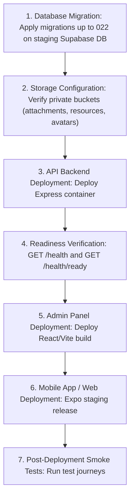

# SkillBridge Staging Deployment & Hardening Runbook

Step-by-step instructions for provisioning, configuring, and verifying SkillBridge in an isolated staging environment prior to production rollout.

---

## 1. Staging Environment Isolation Principles
> [!IMPORTANT]
> - Staging must **never** share Supabase database instances or service-role keys with production.
> - Staging must use isolated LiveKit rooms, Cloudflare TURN namespaces, and Sentry environment tag `staging`.
> - Automated smoke tests and load tests should target staging exclusively.

---

## 2. Environment Variables Checklist

Ensure the following variables are configured in staging `.env`:

```ini
# Server Configuration
PORT=4000
NODE_ENV=staging
LOG_LEVEL=debug
API_VERSION=v1
WEB_ORIGINS=https://staging.skillbridge.example.com,http://localhost:8081

# Supabase Auth & Database (Dedicated Staging Project)
SUPABASE_URL=https://<staging-project-ref>.supabase.co
SUPABASE_ANON_KEY=eyJhbGciOi...
SUPABASE_SERVICE_ROLE_KEY=eyJhbGciOi...

# Error & Performance Monitoring
SENTRY_DSN=https://<key>@o0.ingest.sentry.io/<project>
SENTRY_ENVIRONMENT=staging
SENTRY_RELEASE=skillbridge@3.0.0
SENTRY_TRACES_SAMPLE_RATE=0.2

# LiveKit Video Cloud (Staging Project)
LIVEKIT_URL=wss://<staging-project>.livekit.cloud
LIVEKIT_API_KEY=API...
LIVEKIT_API_SECRET=sec...

# WebRTC & Cloudflare TURN Settings
P2P_CALLS_ENABLED=true
CLOUDFLARE_TURN_ENABLED=true
CLOUDFLARE_TURN_KEY_ID=...
CLOUDFLARE_TURN_API_TOKEN=...
TURN_CREDENTIAL_TTL_SECONDS=3600

# Redis Cache / Presence
REDIS_URL=redis://default:<password>@<staging-redis-host>:6379
REDIS_REQUIRED=false

# Expo Push Notifications
EXPO_PUSH_ACCESS_TOKEN=expo_...
```

---

## 3. Deployment Sequence



---

## 4. Health & Readiness Verification Commands

```bash
# 1. Verify Liveness Probe
curl -i https://staging-api.skillbridge.example.com/health
# Expected: HTTP 200 OK {"success": true, "status": "UP", ...} with X-Request-ID header

# 2. Verify Subsystem Readiness Probe
curl -i https://staging-api.skillbridge.example.com/health/ready
# Expected: HTTP 200 OK {"success": true, "status": "UP", "data": {"database": "enabled", "redis": "enabled", ...}}

# 3. Verify OpenAPI Spec Generation
curl -i https://staging-api.skillbridge.example.com/openapi.json
# Expected: HTTP 200 OK with OpenAPI 3.1.0 JSON schema
```

---

## 5. Pre-flight & Build Verification Commands

```bash
# 1. Run Pre-flight Health Check
node scripts/doctor.mjs

# 2. Run Test Suite with Coverage
npm run test:coverage

# 3. Run Monorepo Lint & Typecheck
npm run lint
npm run typecheck

# 4. Build Production Admin & Backend Bundles
npm run build
```
