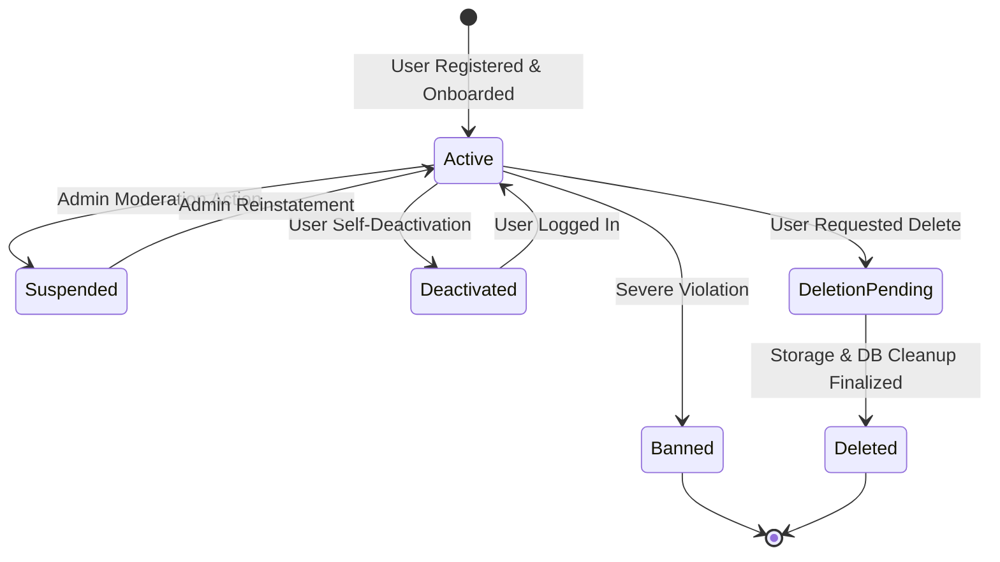
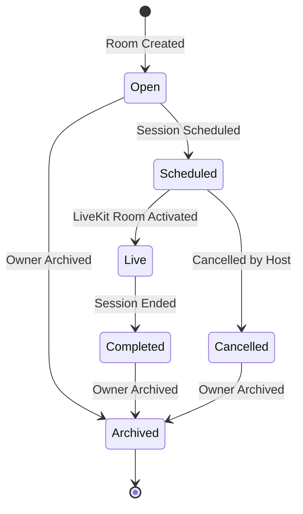
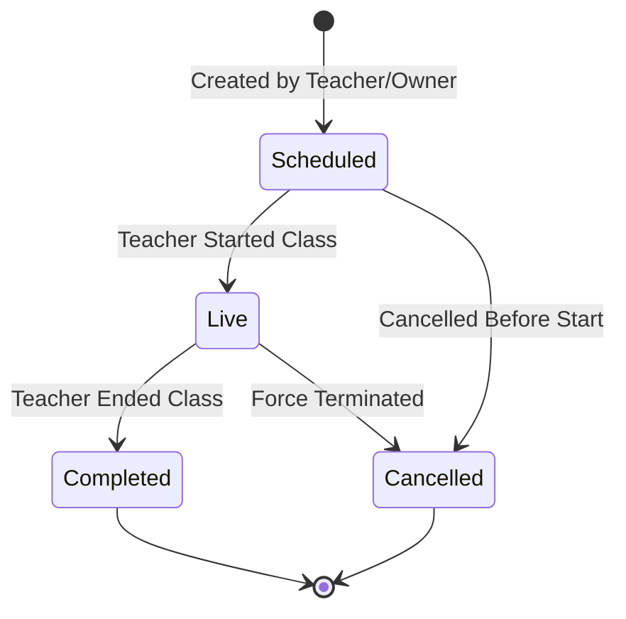
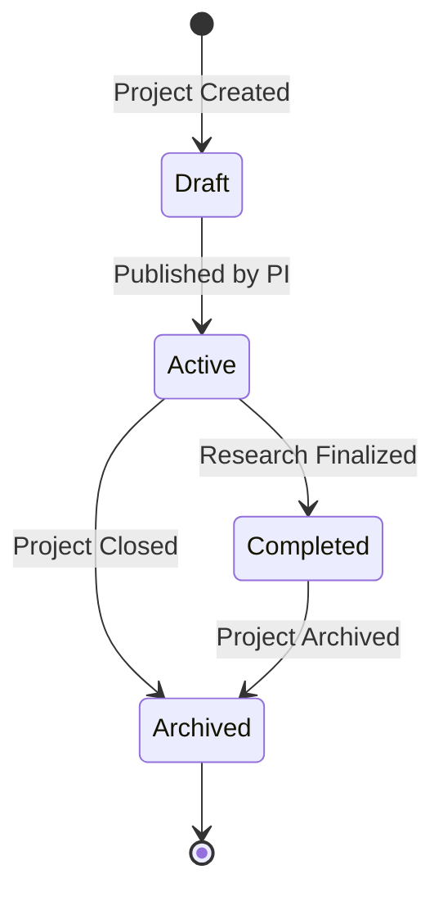
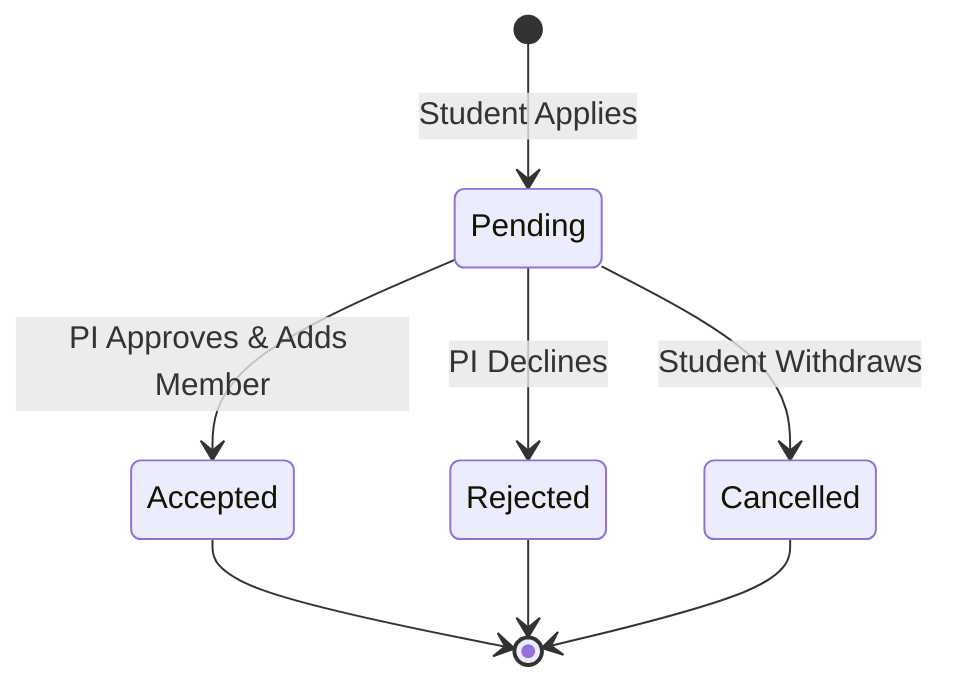
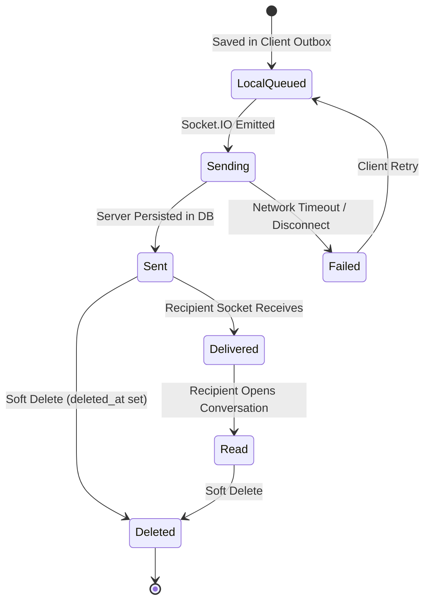

# SkillBridge V3 State Machines & Lifecycle Specifications

SkillBridge V3 governs all business entities via deterministic, validated finite state machines.

---

## 1. Account & Profile State Machine

### Invariants:
- `suspended` / `banned`: HTTP middleware immediately rejects requests with `403 Forbidden`. Sockets and LiveKit tokens are revoked.
- `deletion_pending`: Paginated background cleanup sweeps all storage buckets (`avatars`, `attachments`, `resources`) before deleting the user row from `auth.users`.

---

## 2. Room State Machine

---

## 3. Session State Machine

---

## 4. Research Project & Collaboration State Machine

### Collaboration Application State Machine

---

## 5. Chat Message Delivery State Machine

