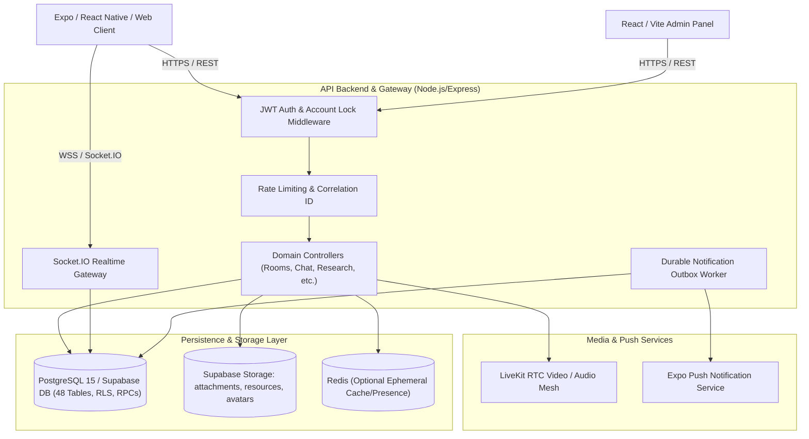
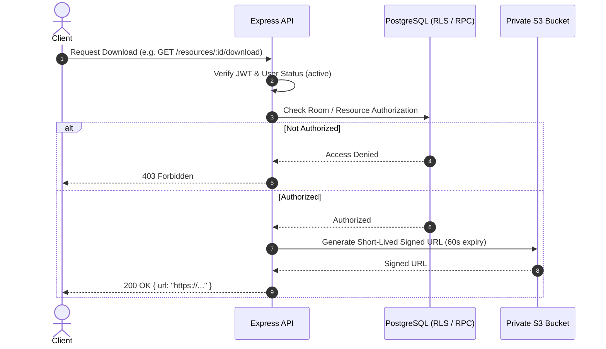

# SkillBridge V3 System Architecture

SkillBridge V3 is an enterprise-grade peer-learning, study room, and collaborative research platform designed for scalability, zero-trust security, and resilience.

---

## 1. System Responsibility Boundaries

- **Client Layer (Expo / React Native / Web)**:
  - Cross-platform presentation layer for iOS, Android, and Web browsers.
  - Local state caching using TanStack React Query, AsyncStorage, and optimistic message queues.
  - Native media drivers (LiveKit React Native SDK, WebRTC, Expo Haptics, Expo Notifications).
- **Application Server (Node.js / Express)**:
  - JWT token verification and centralized account-lockdown enforcement.
  - Domain request validation with Zod schemas.
  - Server-authoritative business logic and atomic transactions.
  - Socket.IO gateway with connection authentication and room isolation.
  - Background outbox worker processing push notifications with exponential backoff.
- **Database & Storage Layer (PostgreSQL 15 / Supabase)**:
  - 48 domain tables with referential integrity constraints.
  - Row-Level Security (RLS) policies preventing unauthorized client queries.
  - `SECURITY DEFINER` atomic stored procedures with explicit `search_path = public` and execution restricted to `service_role`.
  - S3-compatible private object storage for chat attachments and learning materials with signed download claims.
- **Media Engine (LiveKit Cloud / Self-Hosted)**:
  - SFU (Selective Forwarding Unit) video/audio streams.
  - Screen sharing, hand-raising data packets, and active speaker detection.
  - Webhook ingestion for verified attendance tracking.

---

## 2. Zero-Trust Security Model

