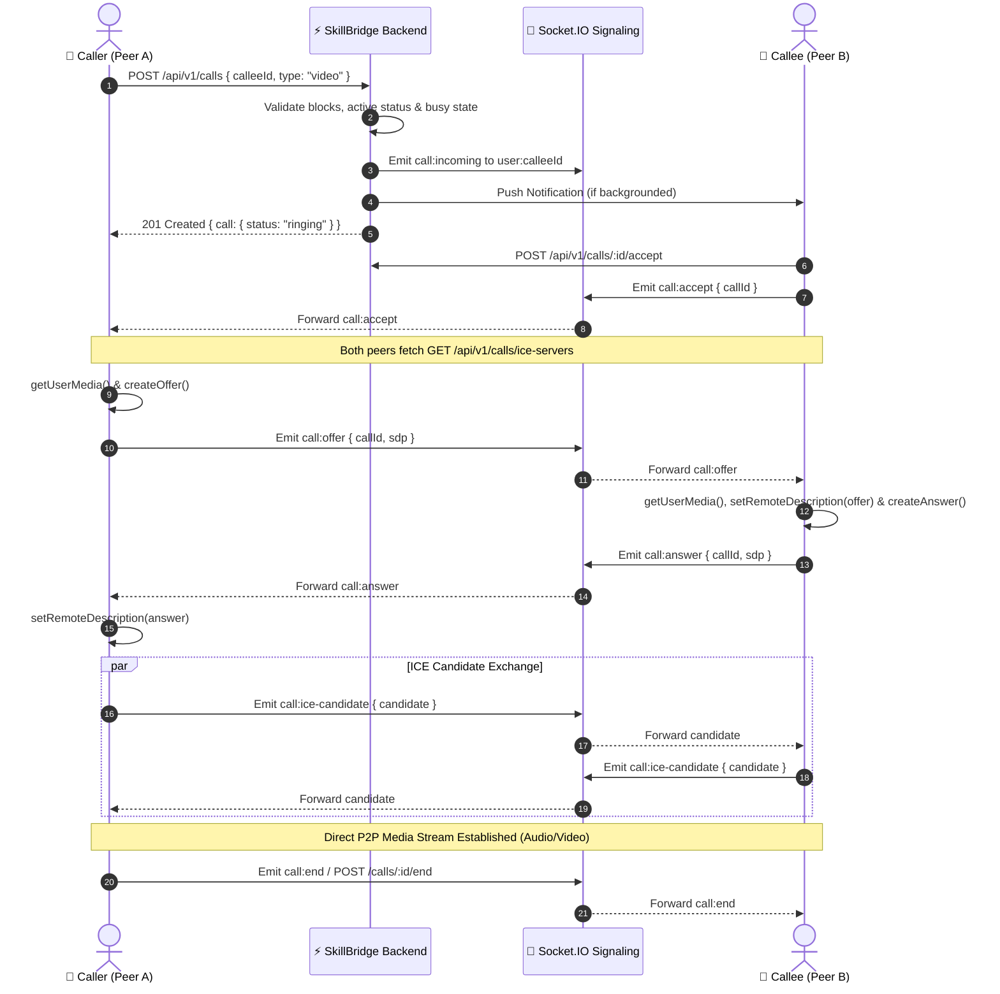

# WebRTC P2P Call Flow & Signaling Protocol

## Sequence Diagram

```mermaid
sequenceDiagram
    autonumber
    actor Caller as 📱 Caller (Peer A)
    participant API as ⚡ SkillBridge Backend
    participant Socket as 🔌 Socket.IO Signaling
    actor Callee as 📱 Callee (Peer B)

    Caller->>API: POST /api/v1/calls { calleeId, type: "video" }
    API->>API: Validate blocks, active status & busy state
    API->>Socket: Emit call:incoming to user:calleeId
    API->>Callee: Push Notification (if backgrounded)
    API-->>Caller: 201 Created { call: { status: "ringing" } }

    Callee->>API: POST /api/v1/calls/:id/accept
    Callee->>Socket: Emit call:accept { callId }
    Socket-->>Caller: Forward call:accept

    Note over Caller,Callee: Both peers fetch GET /api/v1/calls/ice-servers

    Caller->>Caller: getUserMedia() & createOffer()
    Caller->>Socket: Emit call:offer { callId, sdp }
    Socket-->>Callee: Forward call:offer

    Callee->>Callee: getUserMedia(), setRemoteDescription(offer) & createAnswer()
    Callee->>Socket: Emit call:answer { callId, sdp }
    Socket-->>Caller: Forward call:answer

    Caller->>Caller: setRemoteDescription(answer)

    par ICE Candidate Exchange
        Caller->>Socket: Emit call:ice-candidate { candidate }
        Socket-->>Callee: Forward candidate
        Callee->>Socket: Emit call:ice-candidate { candidate }
        Socket-->>Caller: Forward candidate
    end

    Note over Caller,Callee: Direct P2P Media Stream Established (Audio/Video)

    Caller->>Socket: Emit call:end / POST /calls/:id/end
    Socket-->>Callee: Forward call:end
```
