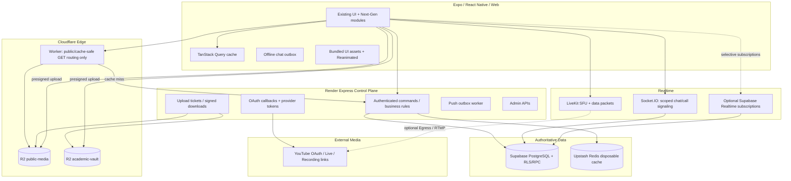

# SkillBridge Next‑Gen — Repository Audit, Antigravity Plan Review & Target Architecture

**Audit date:** 2026-09-13  
**Repository:** `zenbijoy/SKILLBRIDGE-VERSION-01` (`main`)  
**Principle:** **Zero-redesign does not mean zero-refactor.** Preserve the working product and routes, but replace unsafe assumptions and introduce new capabilities behind feature flags and backward-compatible data migrations.

---

## 1. Executive verdict on the Antigravity plan

The Antigravity plan has a **good product direction** but several technical assumptions should not be implemented literally.

### Keep

- Modular room experience with General Chat, Live Session, Q&A, Materials, and Recordings.
- Server-authoritative business mutations and PostgreSQL as the source of truth.
- Direct-to-object-storage uploads rather than relaying large files through Render.
- Redis as disposable cache, never source of truth.
- Club roles, announcements, schedule conflict detection, and negotiation workflow.
- Cloudflare edge caching for genuinely cacheable/public reads.
- Feature flags and admin moderation.

### Correct before implementation

1. **YouTube upload cannot be implemented with a pasted API key.** Channel uploads require OAuth authorization. Treat YouTube as an optional connected provider, not a raw key field.
2. **“Automatically upload every LiveKit recording to YouTube for $0 forever” is not a complete flow.** A recording must first exist. LiveKit recording/export uses Egress, which has its own quota/usage constraints. The free LiveKit Build tier is also concurrency-limited.
3. **Do not architect around “two Cloudflare accounts = guaranteed 20 GB free.”** Use a provider abstraction and logical buckets. A second account may be configured only if it is legitimately available and permitted; the system should work with one account.
4. **Do not manually Brotli/Zstd-compress ordinary social post text in PostgreSQL.** PostgreSQL already handles large values efficiently; manual compression makes search, moderation, indexing, previews, and analytics worse. Media, not text, is the storage problem.
5. **Do not use one bitmask as the reaction data model.** You need to know which user reacted and enforce one reaction per user/post. Use a normalized reaction row with a compact reaction code plus aggregate counters.
6. **Do not promise `<15 ms`, `95% cache hit`, or “zero crash at 1,000+ users.”** Those are performance goals to verify with load tests, not architectural guarantees.
7. **Do not move every chat path to Supabase Realtime immediately.** The current project already has Socket.IO, offline outbox/idempotency, reactions, delivery receipts, and call signaling. A full replacement would violate the zero-redesign requirement.
8. **Never share-cache personalized authenticated responses.** Cloudflare caching needs explicit public/audience-safe cache keys.

---

## 2. Current repository state — what actually exists today

### 2.1 Platform baseline

The repository is already a substantial monorepo, not a small prototype:

- `frontend/`: Expo 57, React 19, React Native 0.86, TypeScript, Expo Router, React Query, Reanimated, LiveKit client, Socket.IO client.
- `backend/`: Node.js 22, Express 5, Socket.IO, Supabase JS, LiveKit server SDK, Redis/ioredis, Zod, Pino, Helmet, rate limiting.
- `admin/`: React/Vite/Tailwind operations console.
- `supabase/migrations/`: database migrations and RPC/RLS evolution.
- `docs/`, `infra/`, validation/audit scripts, Render deployment blueprints.

The backend already exposes domains for rooms, sessions, search, recommendations, events, chat, resources, gamification, quiz, notifications, moderation, live, AI, clubs, research, goals, planner, calendar, bookings, challenges, achievements, activity, progress, CT, calls, and admin.

### 2.2 Home/dashboard is already dynamic

The current dashboard is not hardcoded only in the client. The backend supports:

- configurable widget order/visibility,
- role/campus targeting,
- minimum app versions,
- deterministic feature-flag rollout percentages,
- announcements and dismissals,
- Redis caching,
- multiple user modes.

**Implication:** New Next-Gen areas should plug into this existing dashboard/feature-flag system. Do not invent a second remote-config system.

### 2.3 Room experience exists, but not the proposed five-module dashboard

Current room detail supports:

- join/leave,
- room chat link,
- LiveKit class link,
- peer invitation,
- scheduling,
- resource links,
- teaching volunteer requests,
- sessions and reviews,
- members and roles.

The proposed dedicated Q&A board and recording archive are not present in the current room detail. Materials are present in a simpler generic resource form rather than a full categorized hub.

**Recommendation:** Keep the existing room route and turn its “Room actions” section into the modular dashboard. Do not replace the room model.

### 2.4 Realtime is currently server-based Socket.IO + LiveKit

The app globally establishes a Socket.IO connection after authentication. The server keeps in-memory connection counts and uses rooms for conversation events and 1:1 call signaling. Chat already supports:

- conversation authorization,
- paginated message history,
- client UUID idempotency,
- reactions,
- read/delivered receipts,
- soft deletion,
- attachment tickets,
- push notifications when the recipient is not connected.

**Main scaling improvement:** make the Socket.IO connection **lazy/scoped** instead of always-on for every signed-in user. Keep it when a user is in chat/call flows. Background notifications should use Expo Push. Live-session ephemeral data should use LiveKit data packets where practical.

### 2.5 Storage is Supabase Storage today

Current resource uploads use signed Supabase upload URLs. Private resource downloads are re-authorized and then receive a one-hour signed URL. Chat also has a proper private attachment-ticket route.

There is also a legacy chat upload endpoint that accepts Base64 and writes to the `avatars` bucket. That path should be deprecated rather than expanded.

**Recommendation:** build a `StorageProvider` abstraction first. Add R2 without breaking existing Supabase URLs or data.

### 2.6 Clubs exist, but Club OS does not yet

Current clubs support list/mine/create and owner/admin/member management. Current YouTube “broadcast” support is only a manually supplied `youtubeVideoId` stored in event metadata.

A hardcoded fallback video ID currently exists when event metadata lacks a YouTube ID. Remove that fallback immediately; missing media should be an explicit empty state.

No production clash detector, negotiation state machine, contributor role, or scoped club-announcement workflow is currently visible in the club route.

### 2.7 There is no Facebook-style campus post feed yet

`user_activity_events` is a personal activity timeline. The home dashboard is a widget aggregation surface. That is different from a campus social feed with posts/comments/reactions.

Build the campus feed as a new bounded domain instead of overloading activity events.

### 2.8 Existing visual system should be extended, not discarded

The repo already contains:

- 8 `spotIllustrations`,
- 4 onboarding illustrations,
- 10 growth illustrations,
- MaterialCommunityIcons,
- Reanimated,
- `PremiumHero`,
- Light/Dark/OLED modes,
- accent themes,
- a `reduceMotion` preference.

The current brand palette is approximately:

- blue `#53A9FE`
- violet `#703AF0`
- pink `#F765B6`
- canonical dark `#08101E`

The supplied Next-Gen asset pack intentionally matches this palette and fills gaps for rooms, Q&A, recordings, Club OS, clash detection, empty states, badges, and micro-animations.

### 2.9 Documentation drift exists

The architecture document still refers to older Expo/React/Node versions while package manifests have already moved forward. Treat package manifests as the implementation source of truth and update docs in the first cleanup phase.

---

## 3. Important current risks to fix before major expansion

### P0 — correctness / security / cost-risk cleanup

1. Remove the hardcoded YouTube fallback video ID from club broadcasts.
2. Deprecate the Base64 `/chat/upload` path and standardize on signed attachment tickets.
3. Review the custom Express `/socket.io` “bypass” middleware. Socket.IO normally intercepts its transport at the HTTP server layer; an Express middleware that simply returns without `next()` or a response is confusing and can become a hanging request if transport routing changes. Add a regression test before changing it.
4. Update stale architecture docs to package-manifest versions.
5. Add a `storage_provider` abstraction before R2 migration.
6. Audit global IP-only rate limiting for campus NAT/Wi-Fi. Many students can share one public IP, so 120 requests/minute per IP can create accidental collective throttling. Writes should also have authenticated-user keys and endpoint-specific budgets.
7. Tighten production origin policy. Allowing arbitrary `*.vercel.app` is convenient for previews but broader than necessary for production authentication.
8. Add explicit file size/type policy to every upload-ticket/commit workflow and maintain a `media_objects` record with status.

---

## 4. Corrected target architecture



### Architectural rule

**Render becomes a control plane, not a media pipe.** It validates mutations, signs uploads, mints LiveKit tokens, runs sensitive workflows, and records state. Large blobs and live media do not pass through it.

---

## 5. Modular Study Room v2

Keep the existing `rooms`, `room_members`, `sessions`, conversation, and resources model. Add typed modules around it.

### 5.1 Room dashboard

Five primary cards:

1. **General Chat** — current persistent room conversation.
2. **Live Session** — LiveKit lobby/class + a session-scoped live discussion surface.
3. **Q&A Board** — durable questions, votes, answers, accepted answer, resolved status.
4. **Materials Hub** — existing resources upgraded with categories, type metadata, versions and storage object links.
5. **Recordings** — recording metadata and external/provider playback references.

Do not force the user through five separate nested navigation stacks. Use a room landing dashboard with counts/status and drill-down routes.

### 5.2 Suggested schema additions

- `room_questions`
  - `id`, `room_id`, `author_id`, `title`, `body`, `status`, `accepted_answer_id`, `is_anonymous`, timestamps
- `room_question_votes`
  - unique `(question_id, user_id)`
- `room_answers`
  - `question_id`, `author_id`, `body`, `is_mentor_answer`, timestamps
- `room_recordings`
  - `room_id`, `session_id`, `provider`, `provider_video_id`, `playback_url`, `privacy_mode`, `status`, `duration_seconds`, `recorded_at`, metadata
- extend `resources`
  - category, mime type, size, `media_object_id`, visibility, version/parent id

### 5.3 Live-session chat

Best zero-redesign option:

- General chat stays persistent using current conversation system.
- Live-session ephemeral messages can use LiveKit data packets for users already inside the LiveKit room.
- If you need durable live-session transcript history, persist only accepted/moderated messages or batch writes through a specific API/RPC. Do not duplicate every transient typing/presence event into PostgreSQL.

---

## 6. Storage architecture: migrate safely to R2

### 6.1 Use one logical interface

```ts
interface StorageProvider {
  createUploadTicket(input: UploadTicketInput): Promise<UploadTicket>;
  createDownloadUrl(objectKey: string, ttlSeconds: number): Promise<string>;
  head(objectKey: string): Promise<ObjectMetadata>;
  delete(objectKey: string): Promise<void>;
}
```

Implement:

- `SupabaseStorageProvider` — current data remains valid.
- `R2StorageProvider` — new objects can gradually move.

A database column such as `provider = 'supabase' | 'r2_public' | 'r2_private'` lets old and new objects coexist.

### 6.2 Buckets

Prefer logical separation:

- `skillbridge-public-media`: avatars, club banners, event posters, public feed images.
- `skillbridge-academic-vault`: room documents, private attachments, voice notes.

Do not encode account topology into database/business logic. Credentials and endpoints are deployment configuration.

### 6.3 `media_objects` lifecycle

Recommended states:

`pending_upload → uploaded → ready`  
`pending_upload → expired`  
`uploaded → quarantined/rejected`  
`ready → deleted`

Store:

- object key
- owner
- room/club/post association
- provider/bucket
- mime type
- expected and actual size
- checksum when available
- public/private classification
- created/verified/deleted timestamps

### 6.4 Direct-upload protocol

1. Client requests upload ticket with filename, MIME, bytes, scope.
2. Backend authorizes scope and creates a random server-controlled object key.
3. Client uploads directly to R2/Supabase.
4. Client calls `commit-upload`.
5. Backend `HEAD`s the object, checks size/type expectations, then marks ready and attaches it to domain data.

This avoids trusting a client-provided arbitrary URL/path.

---

## 7. YouTube recording architecture — corrected

### 7.1 What to build first

**MVP:** recording archive accepts a verified YouTube URL/video ID and stores metadata. This works today and does not require a fragile upload worker.

**Connected channel:** implement Google OAuth with the YouTube upload scope and securely store encrypted refresh tokens for a club/room owner connection.

**Automation:** feature-gate it. There are two practical flows:

#### Flow A — LiveKit → YouTube Live/RTMP

- Create/schedule a YouTube Live broadcast for the connected channel.
- Start LiveKit Egress to the YouTube RTMP endpoint.
- Students can watch in app using the YouTube player; interactive participants remain in LiveKit.
- On completion, reconcile the resulting YouTube video ID into `room_recordings`.

This avoids a large post-class MP4 crossing Render.

#### Flow B — Egress file → temporary object → resumable YouTube upload

Use only when required. The Egress output lands in object storage, an asynchronous job performs a resumable YouTube upload, and the temporary object is deleted after verification.

Do **not** perform a multi-gigabyte upload inside a normal Render request/response lifecycle.

### 7.2 Privacy

Unlisted YouTube links are **not access control**. Anyone with the URL can share it. Show this clearly to room owners. For sensitive/private classes, keep the recording in private object storage or disable recording.

### 7.3 Provider state

Suggested tables:

- `external_provider_connections`
  - owner, provider, provider_account_id, encrypted refresh token, scopes, expiry, revoked state
- `recording_jobs`
  - session, provider, state, egress/job IDs, retry count, last error, timestamps

Never accept or store a teacher’s raw YouTube password. Never store OAuth refresh tokens unencrypted.

---

## 8. Campus Social Feed — design for correctness, not micro-optimizations

100,000 text posts are not a database emergency. Optimize query shape and media first.

### 8.1 Tables

- `posts`
- `post_media`
- `post_reactions`
- `post_comments`
- `comment_reactions`
- `post_reports`
- `anonymous_author_map` (restricted/service-only)

### 8.2 Text

Use PostgreSQL `text`. Keep reasonable post/comment length limits. Add full-text/trigram indexes only where search requirements justify them.

### 8.3 Reactions

Use one row per `(post_id, user_id)` with `reaction_type SMALLINT` or a small enum. Maintain aggregate counts on the post using a transaction/trigger or query aggregate. This is auditable and prevents duplicate reactions.

### 8.4 Pagination

Use **keyset/cursor pagination**, not ever-growing OFFSET:

`ORDER BY created_at DESC, id DESC`

Cursor carries `(created_at, id)`.

### 8.5 Anonymous posting

Do not merely hide `user_id` in the UI. Separate public pseudonym from moderator identity.

Recommended anonymity scope options:

- per post/thread (strongest contextual anonymity),
- per room/day,
- per room/term.

Store an HMAC-derived public alias and keep the true-author mapping in a restricted table. Every deanonymization by moderator should create an audit record.

### 8.6 Feed caching

Cache only audience-safe pages, e.g. a truly public university feed. Cache key must include university/campus and feed version. Do not cache a response that contains user-specific fields such as `myReaction`, hidden moderation state, private-club visibility, or personalized ranking under a shared key.

A better split:

- cache **base public post page** at edge,
- overlay user-specific reaction/saved state from a lightweight authenticated endpoint.

---

## 9. Club OS v2

### 9.1 Roles

Preserve current roles and extend safely:

- owner
- admin
- executive
- contributor
- member
- optional alumni/advisor

Keep permission capabilities separate from display titles. A club can call someone “President” while authorization still maps to `owner/admin/executive` capabilities.

### 9.2 Announcements

Reuse the existing announcement/dashboard system instead of creating a duplicate broadcast engine. Add source/audience fields:

- source club
- `internal_members`
- `public_university`
- optional role/subcommittee targets

A verified public club announcement can be projected into both dashboard announcements and the campus feed.

---

## 10. Schedule Clash Detector — upgraded logic

The original “alert only when 50+ members overlap” is not sufficient. A 20-person overlap can be catastrophic for a 25-person club.

### Check four conflict classes

1. **Member overlap** — common verified members/registrants.
2. **Venue overlap** — same room/location at overlapping time.
3. **Personal calendar conflict** — optional warning to affected users.
4. **Academic conflict** — CT/exam/class timetable blocks when available.

### Member severity should use absolute + relative overlap

Example policy (admin configurable, not hard-coded forever):

- warning: `overlap >= 10` and either club loses >=25% of relevant members,
- high: `overlap >= 30` or >=50% of a club,
- critical: exact venue collision or an exam-block rule.

### Efficient query

On an event proposal:

1. Find only events whose time ranges overlap.
2. Join membership/registration indexes only for those candidate events.
3. Return overlap count and sample/aggregate impact.
4. Cache only if profiling shows benefit.

Useful indexes:

- `club_members(club_id, user_id)` unique
- `club_members(user_id, club_id)`
- `events(club_id, starts_at, ends_at)`
- a PostgreSQL range/GiST index if the project adopts `tstzrange`
- `event_registrations(event_id, user_id)` unique

Do not make Redis responsible for conflict truth. Final publish/acceptance must re-check inside PostgreSQL.

---

## 11. Negotiation Engine — use a state machine

Suggested states:

`open → countered → accepted`  
`open/countered → rejected`  
`open/countered → expired`  
`open/countered → cancelled`

A proposal stores exactly what would change:

- target event ID
- proposed start/end
- optional venue
- optional second event change
- initiator club/admin
- target club/admin
- version number
- expiry

When accepted:

1. lock the relevant event rows,
2. verify proposal version/current event version,
3. re-run conflict validation,
4. update only the explicitly agreed event(s),
5. write an audit event,
6. enqueue notifications,
7. commit once.

Never silently move the other club’s event merely because one admin accepted a generic “negotiation”.

---

## 12. Render free-tier strategy — realistic version

The free Render web plan is currently 0.1 CPU / 512 MB RAM and is explicitly positioned for hobby/testing, not durable production. Design to survive constraints, but do not promise production availability.

### Highest-impact changes

1. **Lazy Socket.IO:** do not keep a socket open for every authenticated browser/mobile session. Connect on chat/call demand; disconnect after an idle grace period.
2. **No media relay:** direct signed uploads; LiveKit/YouTube carry video.
3. **Cache dashboard/discovery:** current Redis use is already a good foundation.
4. **Edge-cache only safe public reads.**
5. **Use keyset pagination and narrow SELECT lists.**
6. **Bound every list/query.**
7. **Keep workers lightweight.** Long jobs must be resumable and externalized.
8. **Graceful degradation:** Redis optional, recording automation optional, AI optional, cached UI/offline state maintained.

### Define testable capacity targets, not slogans

Example prototype acceptance targets:

- 1,000 signed-in users browsing largely cached/read-heavy content during a synthetic test,
- bounded write scenario (e.g. 50–100 concurrent write clients) without memory runaway,
- no API request relays multi-MB files,
- p95 and p99 measured separately for cold and warm states,
- memory high-water mark observed below the service limit with safety headroom.

Live video capacity is a separate limit from API browsing capacity.

---

## 13. LiveKit + large audience strategy

Do not treat 1,000 app users as 1,000 LiveKit participants on a free plan.

Support session modes:

- `interactive`: LiveKit classroom for a small interactive cohort.
- `broadcast`: YouTube/stream player for large watch-only audience + SkillBridge Q&A/chat.
- `hybrid`: teachers/selected speakers are interactive; wider audience watches broadcast.

This is a much better fit for a university platform and reduces media cost dramatically.

---

## 14. Edge Worker route policy

### Cache candidates

- public club directory
- public event directory
- public room discovery (sanitized)
- public campus-feed base pages
- public profile card metadata if privacy permits
- static R2 public media

### Never shared-cache

- `/me`
- private room data
- member lists
- chat/message history
- private materials
- notification inbox
- admin endpoints
- personalized recommendations
- any response whose authorization changes content unless the cache key is safely audience-partitioned

### Worker responsibilities

- normalize cache keys,
- attach request/correlation ID if absent,
- reject obviously oversized/abusive public requests,
- stale-while-revalidate for public GETs,
- preserve authorization and bypass cache for protected requests,
- never contain Supabase service-role credentials.

---

## 15. Observability, safety and operations

The repo already has Pino/Sentry foundations. Extend them with domain metrics:

- API latency by route/status
- cold-start markers
- Redis hit/miss/error ratio
- room join/token errors
- LiveKit webhook failures
- active Socket.IO connections
- R2 ticket/commit failures
- upload bytes by media class
- feed cache hit rate
- moderation reports and response time
- schedule conflicts detected / negotiated / accepted
- recording job states

Add a system-health/admin view for provider status and quotas. Never expose provider secrets.

---

## 16. Visual integration rules

The Next-Gen asset pack should be treated as a source library, not copied wholesale into the shipped bundle.

### Use artwork for

- first-visit onboarding
- empty/offline/error states
- room module introduction
- Club OS / clash explainer
- live lobby
- success feedback
- marketing/premium hero sections

### Do not

- put looping GIFs inside every feed card,
- animate every section simultaneously,
- replace standard icons with large illustrations,
- ignore `reduceMotion`,
- introduce a new color system that fights the current theme.

### Motion budget

- press feedback: 100–160 ms
- card entry: 180–260 ms
- modal/sheet: 220–320 ms
- looping ambient hero motion: 2.8–4 s and subtle
- success burst: <=1.5 s
- respect reduced motion with static state

---

## 17. Implementation order

### Phase 0 — baseline + cleanup

- run full install/typecheck/lint/tests/build
- snapshot API/schema behavior
- fix club YouTube fallback
- deprecate legacy Base64 chat upload
- verify socket transport middleware
- update architecture docs
- add new feature flags

**Exit:** no regression, CI green.

### Phase 1 — Visual Next-Gen integration + Room dashboard shell

- integrate only selected new assets
- preserve existing theme/tokens
- turn current Room Actions into five-module dashboard
- routes can initially point to existing chat/live/resources and new “coming behind flag” Q&A/recordings

**Exit:** UI is coherent without changing data semantics.

### Phase 2 — Q&A + Materials v2 + Recordings metadata

- migrations/RLS/RPC
- APIs/OpenAPI/tests
- room Q&A UI
- categorized resources
- recording metadata/link archive

**Exit:** five cards are all functional without automated recording.

### Phase 3 — Storage abstraction + R2

- `StorageProvider`
- `media_objects`
- R2 signed direct upload/commit
- dual-provider compatibility
- gradual migration of new media classes

**Exit:** no large file bytes traverse Render.

### Phase 4 — Campus feed

- posts/comments/reactions/anonymous mapping
- keyset pagination
- moderation/reporting
- public/base feed cache design

**Exit:** 100k-post synthetic dataset remains responsive; search/moderation work.

### Phase 5 — Club OS + clash detector

- extended roles/capabilities
- announcements integration
- event overlap engine
- conflict visualizer
- negotiation state machine + transactional acceptance

**Exit:** concurrent negotiation race tests pass.

### Phase 6 — Realtime + Render optimization

- lazy socket lifecycle
- LiveKit data for live-room transient events
- optional selective Supabase Realtime subscriptions
- edge cache-safe public GETs
- user-aware mutation rate limits

**Exit:** load test report exists; no “zero-crash” marketing claim without evidence.

### Phase 7 — YouTube connected provider / automation

- OAuth connection
- encrypted token storage
- manual-link first
- optional LiveKit Egress → YouTube Live/recording automation under feature flag
- failure/retry/reconciliation state machine

**Exit:** provider revocation/retry/private-mode behavior tested.

### Phase 8 — progressive rollout

Roll out 5% → 20% → 50% → 100% by existing feature flags, observing Sentry, API p95/p99, memory, provider quotas and user feedback.

---

## 18. Final recommendation

The correct evolution is **not** “put Cloudflare in front of everything and rewrite realtime.” SkillBridge already has solid server-authoritative foundations, a dynamic dashboard, offline-aware chat, LiveKit, admin control, and feature flags.

The strongest next step is:

**Preserve the existing product → modularize the room UI → add typed Q&A/recordings → introduce storage abstraction → build Campus Feed and Club OS → then optimize edge/realtime based on load-test evidence.**

That sequence gives the product much more capability without destabilizing the codebase.
